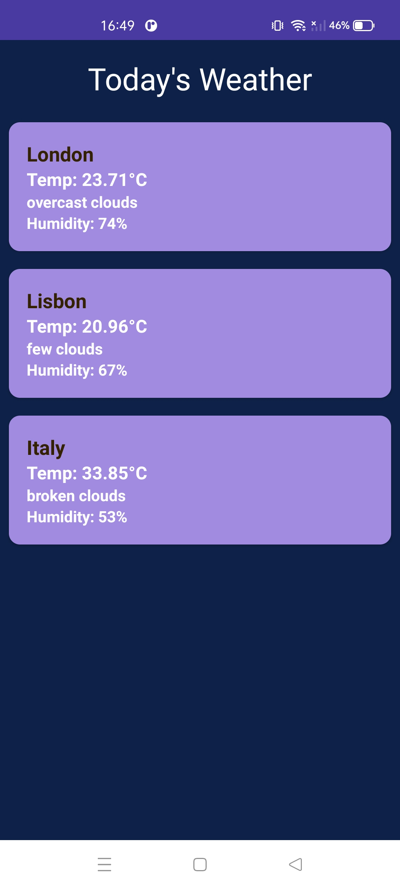

# 🌦️Weather App

---

A modern Android app that fetches and **displays real-time weather data for multiple cities**.

Built with **Kotlin, MVVM**, and modern Android tools, this project showcases production-level coding standards, scalability and user-centric design, and a strong focus on maintainability, scalability and user-centric UI — matching the expectations of European tech teams and product-driven companies.

---

## ✨ **Features**
- Real-time weather data from external APIs
- Supports multiple cities
- Clean, intuitive UI following Material Design principles
- Modular, maintainable and scalable architecture
- Fast, responsive performance
- Ready to expand with additional features and testing

---

## 🛠 **Tech Stack & Architecture**
- **Android SDK**
- **Kotlin** – concise, safe and modern Android development
- **MVVM** – clear separation of concerns and easier maintenance
- **Retrofit** – HTTP client to fetch weather data
- **LiveData** – reactive UI updates
- **Material Components & ConstraintLayout** – modern UI toolkit
- **Gradle (Kotlin DSL)** – modern build system
- **Version control using TOML**

---

## 🎨 **UI & UX**
- Responsive design aligned with **Material Design** guidelines
- Smooth user interactions and feedback
- Supports different device sizes
- XML layouts structured with **ConstraintLayout** for better performance

---

## ✅ **Testing**
- Architecture designed to support:
  - Unit tests (JUnit)
  - UI tests (Espresso)
  - Integration tests

---

## 💻 **Tools Used**
- **Android Studio Narwall**
- **Git & GitHub** – collaboration & CI/CD
- Android emulator or real device for testing

---

## 🌍 **Why this project matters?**

This Weather App was created not just as a portfolio piece, but to showcase real-world Android development practices valued by European tech companies:

- ✅ **Clean, modular architecture** for maintainability and scalability  
- ⚡ **Real-time API consumption** using Retrofit and JSON parsing  
- 📦 **Separation of concerns** following MVC & Clean Architecture principles  
- 🎨 **Modern, intuitive UI** built with Material Design  
- ✏️ **Readable and collaborative codebase**, ready for teamwork  
- 🧪 **Testing culture** with plans for unit, UI and integration testing  
- 🌱 **Expandable foundation** for future features like alerts or location-based weather

By combining Java best practices, modern design patterns and clean UX, this project demonstrates readiness to build production-level, user-focused Android applications.

---

## ⏱ **Agile Methodology**
- **Kanban** for task organization and incremental delivery

---

### ✅ Status: On Going 👩🏻‍💻

---

## 📱 **Screenshots**

  
  
  

---

## 💡 **Interested in collaborating or hiring?**
📩 Reach out or 👉 [**Connect on LinkedIn**](https://www.linkedin.com/in/laura-oliveira-mobile/)

📧 laura.oliveira.tech@gmail.com

Let’s build modern, scalable and elegant Android apps together.

---

> ⭐ *Thank you for visiting! Let’s create something impactful!*
